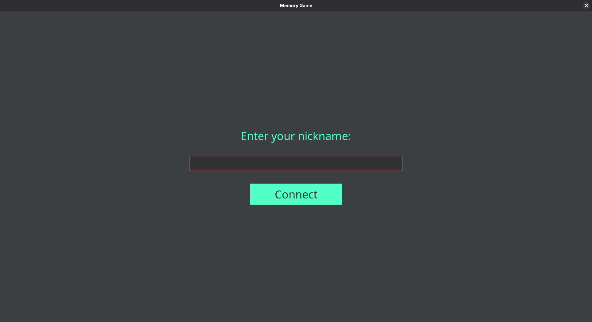
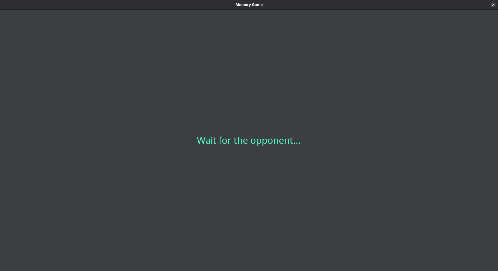
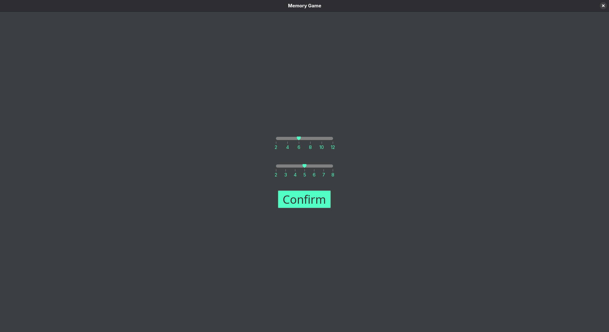
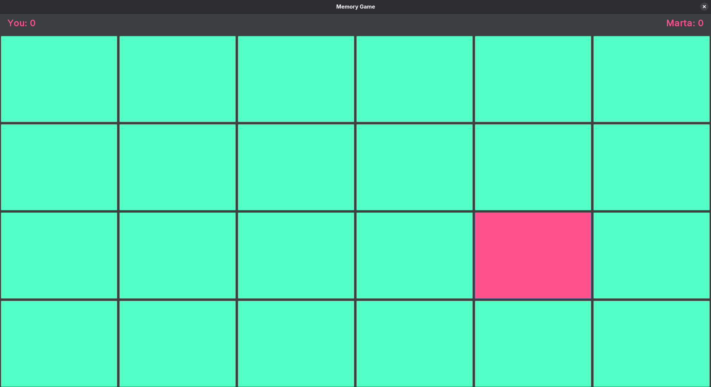
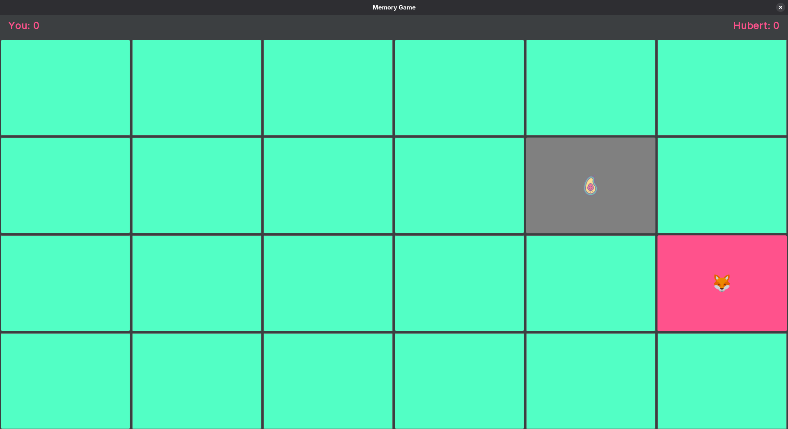
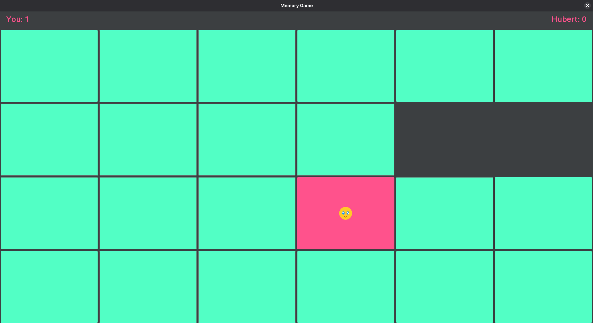
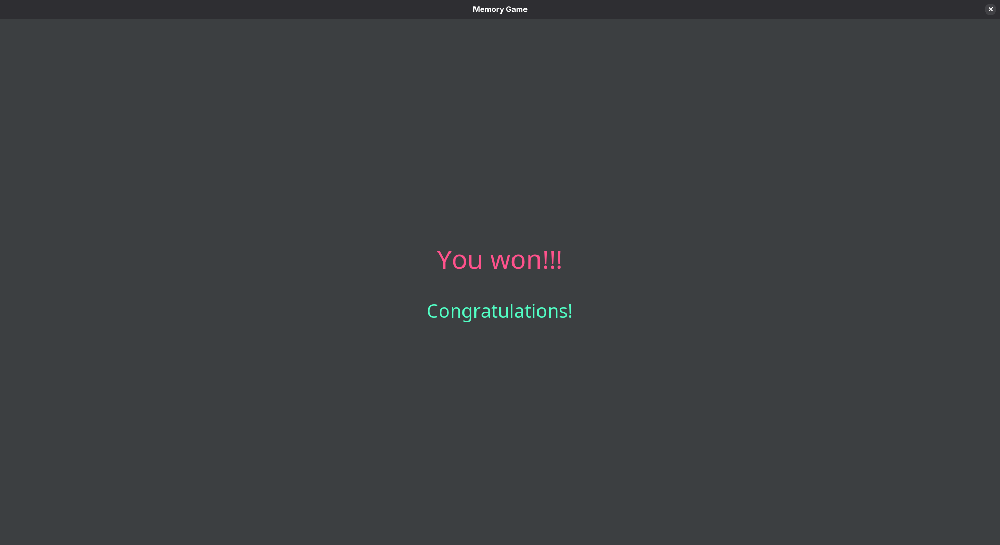
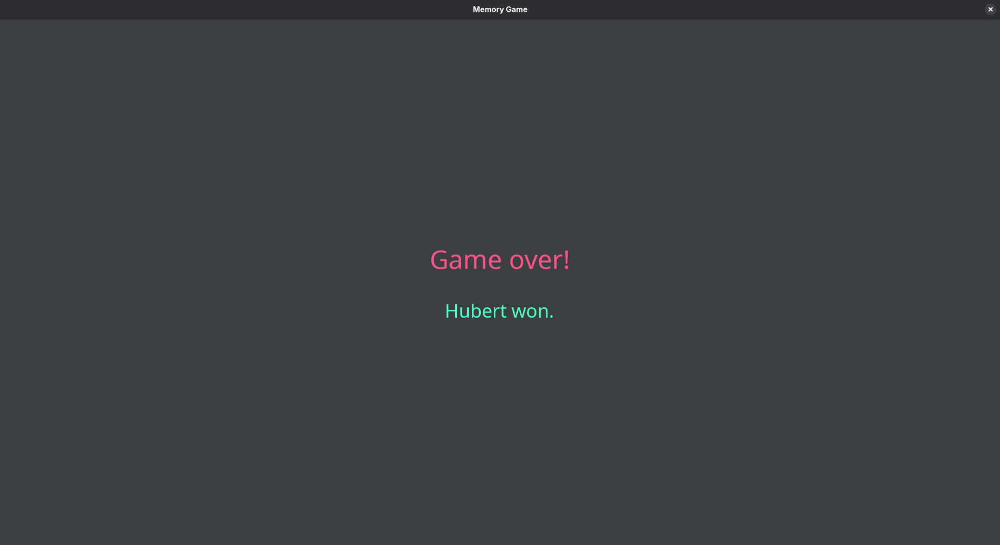

# Memory_game
***Implementation of multiplayer memory game with concurent and distributed processing***

## 1. Game Description

The project is a two-player network-based Memory Game written in Java. Players connect over the same local network using a client–server architecture. The game is played on a board of face-down cards, where players take turns flipping two cards. If the selected cards match, they remain revealed and the player gains a point (and an additional turn). If they do not match, they are flipped back over. The game continues until all pairs are found, and the player with the most matches at the end wins.

The client application provides a graphical user interface, while the server is responsible for maintaining the game state, enforcing rules, and synchronizing actions between both players in real time.

## 2. Project File Structure

The project is divided into three main modules: client, server, and common.

The client module contains the graphical user interface and the networking logic required to communicate with the server. It includes classes responsible for managing the connection, handling user interactions, and updating the game views. It also includes a resources directory containing all the images for card fronts.

The server module contains the main server application, client handling logic, and the implementation of the core game mechanics. Each connected client is handled separately, and the server coordinates gameplay between them.

The common module contains shared classes used by both client and server. These include the game, player and card models used for communication.

## 3. Concurrency and Multithreading

The application makes use of concurrency to support real-time multiplayer gameplay and smooth communication between clients and the server.

On the server side, each connected client is handled in a separate thread to allow multiple players to interact with the system simultaneously. This is implemented using Thread. Since multiple threads may access shared game state at the same time, synchronized blocks and methods are used to prevent race conditions and ensure consistency.

The project also uses the java.util.concurrent package. A ScheduledExecutorService is used to handle delayed actions such as flipping cards back after a mismatch. ScheduledFuture is used to manage scheduled tasks, including the ability to cancel or control execution when needed. Executors are used for managing thread pools and organizing concurrent tasks efficiently.

The server uses ServerSocket to accept incoming connections and creates a new Socket for each client. Communication between server and clients is asynchronous, meaning messages can arrive at any time and are processed independently by each client thread. Iterator is also used in some cases to safely traverse shared collections during concurrent operations.

## 4. External Libraries and Frameworks

The project uses several external libraries in addition to the standard Java libraries.

For the graphical user interface, FlatLaf is used to provide a modern look and feel for the Swing-based application.

Lombok is used to reduce boilerplate code by automatically generating methods such as getters and setters.

The project also relies heavily on standard Java libraries, including javax.swing and java.awt for the GUI, java.net for networking functionality, java.io for input and output operations, java.util for collections and utility classes, and java.util.concurrent for concurrency support.

## 5. Concurrency Methods Used

The following concurrency-related mechanisms are used in the project: Thread and Runnable for creating and managing threads, synchronized blocks and methods for controlling access to shared resources, Executors for managing thread pools, ScheduledExecutorService for scheduling delayed tasks, and ScheduledFuture for handling scheduled task execution and cancellation. Additionally, ServerSocket.accept is used to handle incoming client connections in a multi-client environment.

## 6. Screenshots

The initial screen allows to type a username:

Then the first user to connect has to wait fro the other one:

And the other user chooses the board size:

Then, the board is displayed:

And the users can, in turns, pick up cards:

When a user chooses a correct pair, the pair is "taken" from the screen:

When all the cards are collected, either one user wins:

and the other one loses:

or there is a tie.

## 7. Team Contributions

Marta was responsible for designing and implementing the user interface using Swing and FlatLaf, as well as integrating the GUI with the client-side logic and networking layer.

Hubert developed most of the server-side logic, including the implementation of core game mechanics and state management. He also contributed significantly to the backend concurrency handling.

Both team members worked together on implementing and refining the communication protocol between the server and clients, as well as on the multithreading and synchronization aspects of the system.